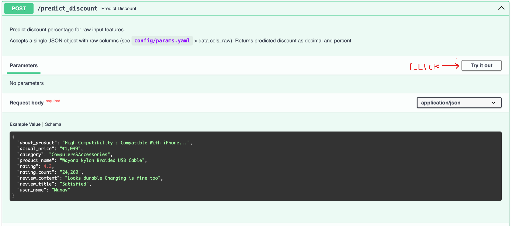
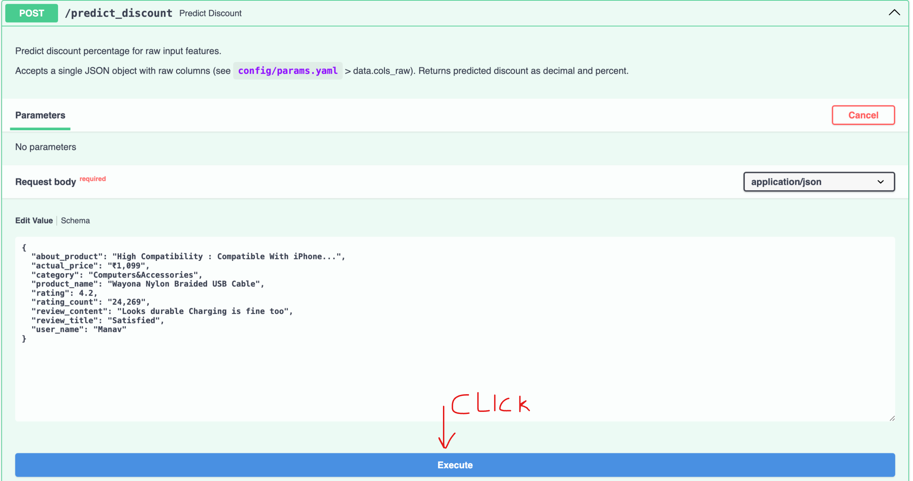
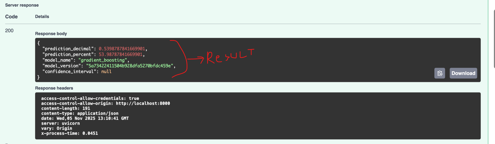
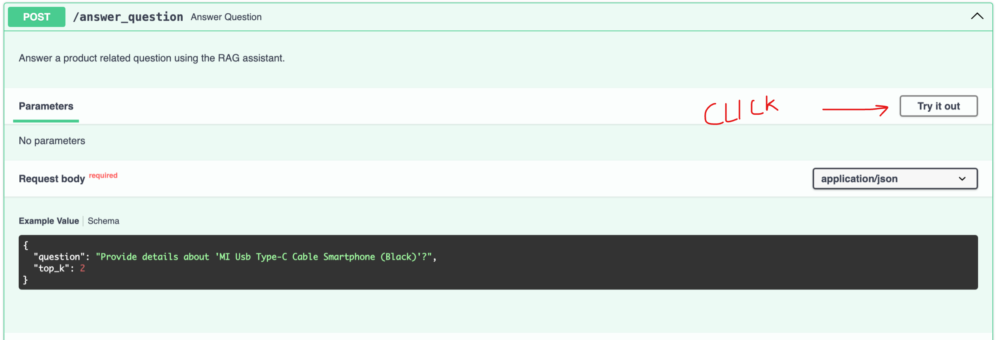
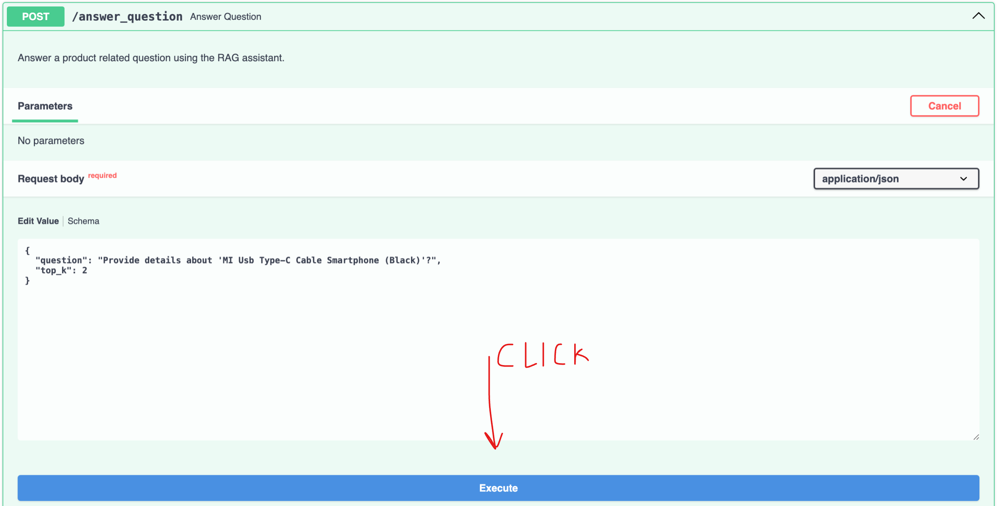
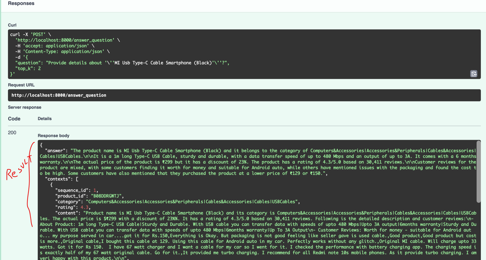

# Amazon Sales Discount Percentage Predictor

This project aims to predict the discount percentage of products sold on Amazon using machine learning techniques. By analyzing various features of the products, we can estimate the discount percentage that a product might have during sales events.
It also provides a QnA API Endpoint where user can ask about the product on Amazon, like, "Provide details about 'MI Usb Type-C Cable Smartphone (Black)'?", etc.

## 🎯 Project Overview

This is a production-grade MLOps Pipeline showcasing:

- **Data Ingestion Pipeline**: Automated data loading, validation, preprocessing, and feature engineering
- **Data Versioning**: Using DVC for reproducible data management
- **Quality Monitoring**: Automated data quality metrics and validation
- **Pipeline Orchestration**: DVC-based reproducible pipelines
- **Production Best Practices**: Logging, error handling, testing, and monitoring

## 📋 Prerequisites

- Docker and Docker-Compose installed and running.

## Running the docker container

1. Run `docker compose build --no-cache && docker compose up -d`
1. Browse to [localhost:8000](http://localhost:8000/docs) for API documentation.

### Cleanup

1. Run `docker compose down`

> NOTE: The project has been tested on MacOS (Apple Silicon).

## Running into local machine

### 1. Setup Development Environment

**Using uv (recommended):**

```powershell
# Create virtual environment
uv venv

# Activate the virtual environment
.\.venv\Scripts\activate

# Install dependencies
uv pip install -r requirements.txt
```

**Using pip:**

```powershell
# Create virtual environment
python -m venv .venv

# Activate the virtual environment
.\.venv\Scripts\activate

# Install dependencies
pip install -r requirements.txt
```

### Run Python scripts to setup

1. `cd src`
1. Run: `python data_ingestion_pipeline.py`
1. Run: `python model_training_pipeline.py`
1. Run: `python model_evaluation_pipeline.py`
1. Run: `python model_inference_pipeline.py`
1. Run: `python rag_pipeline.py`
1. Run: `python run_api.py`
1. Browse to [localhost:8000](http://localhost:8000/docs) for API documentation.

## Usage

### Predict Discount

1. Browse to [localhost:8000](http://localhost:8000/docs) for API documentation.
1. 
1. 
1. 

### Answer Question (RAG Endpoint)

1. Browse to [localhost:8000](http://localhost:8000/docs) for API documentation.
1. 
1. 
1. 

## 🚀 Quick Start

### 1. Setup Development Environment

**Using uv (recommended):**

```powershell
# Create virtual environment
uv venv

# Activate the virtual environment
.\.venv\Scripts\activate

# Install dependencies
uv pip install -r requirements.txt
```

**Using pip:**

```powershell
# Create virtual environment
python -m venv .venv

# Activate the virtual environment
.\.venv\Scripts\activate

# Install dependencies
pip install -r requirements.txt
```

### 2. Initialize DVC

```powershell
python -m dvc init
python -m dvc config core.analytics false
```

### 3. Setup Data Versioning

```powershell
# Add raw data to DVC tracking
python -m dvc add data/raw/amazon.csv

# Commit the DVC file to git
git add data/raw/amazon.csv.dvc data/raw/.gitignore
git commit -m "Add raw data tracking with DVC"
```

### 4. Setup Remote Storage (Optional but Recommended)

**Local Remote (for development):**

```powershell
python -m dvc remote add -d localremote ./dvc_storage
python -m dvc push
```

## 🔧 Running the Pipeline

### Using DVC Directly

You can reproduce the full pipeline (all stages defined in `dvc.yaml`) with:

```powershell
# Reproduce the entire pipeline
python -m dvc repro

# Force re-run all stages
python -m dvc repro --force
```

Run an individual stage by name (useful during development):

```powershell
# Run only the data ingestion stage
python -m dvc repro data_ingestion

# Run only the model training stage
python -m dvc repro model_training

# Run only the model evaluation stage
python -m dvc repro model_evaluation

# Run only the model inference stage
python -m dvc repro model_inference
```

## 📊 Pipeline Outputs

After running the pipeline, the following artifacts will be generated:

### Processed Data

- `data/processed/selected.csv` - Selected columns from raw data
- `data/processed/X_train.csv` - Training features
- `data/processed/y_train.csv` - Training target
- `data/processed/X_test.csv` - Test raw features
- `data/processed/y_test.csv` - Test raw target

### Artifacts

- `artifacts/preprocessor.joblib` - Fitted preprocessing pipeline (scalers, encoders)
- `artifacts/data_quality_metrics.json` - Comprehensive data quality metrics
- `artifacts/experiments.csv` - Training experiment records (hyperparams, scores)
- `artifacts/model.joblib` - Trained model artifact
- `artifacts/eval_metrics.json` - Evaluation metrics for the final model
- `artifacts/predictions.csv` - Inference output (predictions on test set)

### Logs

- `logs/data_ingestion.log` - Data Ingestion logs
- `logs/model_training.log` - Model Training logs
- `logs/model_evaluation.log` - Model Evaluation logs
- `logs/model_inference.log` - Model Inference logs

## 📈 Monitoring & Validation

### View Data Quality Metrics

```powershell
type artifacts\data_quality_metrics.json
```

## 🧪 Testing

### Run unit tests

You can run the full test suite with pytest. From the project root (PowerShell):

```powershell
# Activate your virtual environment first (if not already active)
.\.venv\Scripts\activate

# Run all tests (verbose)
cd tests
python -m pytest -v --tb=short
```

### Run specific tests

Run an individual test or test file from the `tests` folder:

```powershell
cd tests
python -m pytest test_loader_validator_transformer.py::test_data_loader_csv_reads_and_errors -v
```

### Run the API

Start the FastAPI server from the project root. Make sure your virtual environment is active and dependencies are installed.

PowerShell options:

```powershell
# Recommended: run the launcher script
cd src
python .\run_api.py
```

When the server starts you should see the URL and docs info printed, for example:

```
📍 URL: http://0.0.0.0:8000
📚 Docs: http://0.0.0.0:8000/docs
❤️  Health: http://0.0.0.0:8000/health
```

Open the interactive API docs at `http://localhost:8000/docs` to try endpoints.

### Consume the API

Use these examples to call the running API. Replace host/port if you changed them in `config/params.yaml`.

Health check (curl / PowerShell):

```powershell
curl -X GET "http://localhost:8000/health" -H "Accept: application/json"
```

Model info:

```powershell
curl -X GET "http://localhost:8000/model/info" -H "Accept: application/json"
```

Predict discount (example payload):

```powershell
curl -X POST "http://localhost:8000/predict_discount" -H "Content-Type: application/json" -d '{
  "product_id": "123",
  "product_name": "Sample Product",
  "category": "electronics",
  "actual_price": 99.99,
  "rating": 4.5,
  "rating_count": 120,
  "about_product": "Example description",
  "user_id": "u1",
  "user_name": "tester",
  "review_id": "r1",
  "review_title": "Good",
  "review_content": "Nice product",
  "img_link": "http://example.com/img.jpg",
  "product_link": "http://example.com/product/123"
}'
```

Python example using requests:

```python
import requests

payload = {
    "product_id": "123",
    "product_name": "Sample Product",
    "category": "electronics",
    "actual_price": 99.99,
    "rating": 4.5,
    "rating_count": 120,
}

resp = requests.post("http://localhost:8000/predict_discount", json=payload)
print(resp.status_code)
print(resp.json())
```

Notes:

- The `/docs` UI is the easiest place to experiment with the JSON schema expected by `/predict_discount`.
- If the model or preprocessor artifacts are missing (e.g., `artifacts/model.joblib`), the API will start but the `/predict_discount` endpoint may return a 503 until you run the pipeline to produce artifacts.

## 📁 Project Structure

```
amzn-sales-project/
├── app.py                      # Web app/entrypoint for serving or CLI
├── api/                        # API or service layer
├── src/                        # Source code and pipeline scripts
│   ├── data_ingestion_pipeline.py
│   ├── model_training_pipeline.py
│   ├── model_evaluation_pipeline.py
│   ├── model_inference_pipeline.py
│   ├── data_ingestion/         # Data ingestion modules
│   │   ├── load_csv.py
│   │   ├── validate_data.py
│   │   ├── preprocess_data.py
│   │   └── data_quality.py
│   └── model_trainers/        # Model training utilities
│       ├── trainer.py
│       └── model_factory.py
├── data/                       # Data (raw and processed)
│   ├── raw/
│   │   └── amazon.csv
│   └── processed/
│       ├── selected.csv
│       ├── X_train.csv
│       ├── y_train.csv
│       ├── X_test.csv
│       └── y_test.csv
├── artifacts/                  # Generated artifacts and metrics
│   ├── preprocessor.joblib
│   ├── data_quality_metrics.json
│   ├── experiments.csv
│   ├── model.joblib
│   ├── model.meta.json
│   ├── eval_metrics.json
│   └── predictions.csv
├── config/
│   └── params.yaml            # Configuration parameters
├── dvc.yaml                    # DVC pipeline definition
├── tests/                      # Unit tests
├── requirements.txt            # Python dependencies
├── Dockerfile                  # Containerization
```

## 🔄 Pipeline Stages

### Data Ingestion Stage

The data ingestion pipeline consists of the following steps:

1. **Load Data**: Read raw CSV data from configured path
2. **Validate Data**: Check for required columns and data integrity
3. **Select Columns**: Extract relevant features and target
4. **Split Data**: Create train-test split (80-20 by default)
5. **Preprocess**: Apply transformations (encoding, scaling, feature engineering)
6. **Save Outputs**: Write processed data and artifacts
7. **Generate Metrics**: Calculate and save data quality metrics

### DVC pipeline stages

The DVC pipeline (`dvc.yaml`) defines four main stages. You can run them individually as shown above.

- `data_ingestion` — load, validate, select columns, split and preprocess raw data. Produces processed datasets and preprocessing artifacts.
- `model_training` — train models using the processed training data, record experiments and save the best model to `artifacts/model.joblib`.
- `model_evaluation` — evaluate the trained model on the test set and write evaluation metrics to `artifacts/eval_metrics.json`.
- `model_inference` — run inference using the trained model and produce `artifacts/predictions.csv`.

## ⚙️ Configuration

All pipeline parameters are centralized in `config/params.yaml`:

```yaml
data:
  path: ../data/raw/amazon.csv
  test_size: 0.2
  random_state: 42
  # ... more configuration
```

Modify this file to adjust pipeline behavior without changing code.

## 🚢 Production Deployment Checklist

- [ ] Setup remote DVC storage (S3/GCS/Azure)
- [ ] Configure environment variables for credentials
- [ ] Setup CI/CD pipeline (GitHub Actions/Jenkins)
- [ ] Add data drift monitoring
- [ ] Setup automated testing in CI
- [ ] Configure alerting for pipeline failures
- [ ] Document data schema and validation rules
- [ ] Setup model registry for artifacts
- [ ] Add performance benchmarking
- [ ] Implement rollback mechanism

## 📝 Best Practices Implemented

✅ **Modular Code**: Separation of concerns with dedicated modules  
✅ **Configuration Management**: Centralized params.yaml  
✅ **Logging**: Comprehensive logging at all stages  
✅ **Error Handling**: Proper exception handling and exit codes  
✅ **Data Validation**: Schema validation and quality checks  
✅ **Testing**: Unit tests for all components  
✅ **Reproducibility**: DVC pipeline for deterministic runs  
✅ **Monitoring**: Data quality metrics and validation reports  
✅ **Documentation**: Clear README and inline comments  
✅ **Version Control**: Git for code, DVC for data  

## 🆘 Troubleshooting

### Issue: DVC not initialized

```powershell
# Solution: initialize DVC and disable analytics
python -m dvc init
python -m dvc config core.analytics false
```

### Issue: Missing dependencies

```powershell
# Solution:
pip install -r requirements.txt
```

### Issue: Data file not found

```powershell
# Solution: Pull data from DVC remote
python -m dvc pull
```

### Issue: Pipeline fails with validation error

```powershell
# Solution: Reproduce the pipeline (this will run validation stages)
python -m dvc repro
```

## 🔎 RAG (Retrieval-Augmented Generation) Pipeline

This repository includes a lightweight RAG pipeline that:

- Ingests product and review data into a Chroma vector store (persisted under `chroma_db`).
- Builds a simple RetrievalQA chain using a configured LLM to answer sample questions.

Where to find it:

- Script: `src/rag_pipeline.py` — top-level runner that performs ingestion then runs a sample QA query.
- Ingestor: `src/data_ingestion/rag_data_ingestion.py` — converts product rows into text documents and persists them to Chroma.
- QA chain: `src/rag_chains/qa_chain.py` — thin wrapper around a RetrievalQA chain.

How to run (development):

```powershell
cd src
python .\rag_pipeline.py
```

DVC stage: A DVC stage `rag_pipeline` was added to `dvc.yaml`. You can reproduce that stage with:

```powershell
python -m dvc repro rag_pipeline
```

Notes:

- The RAG pipeline uses several optional heavy dependencies (embedding models, Chroma, and LLM backends). The unit tests provide lightweight fakes so you can run tests without installing those packages.
- The `src/rag_pipeline.py` module avoids performing environment and file-system side-effects at import time to make testing and packaging easier.
